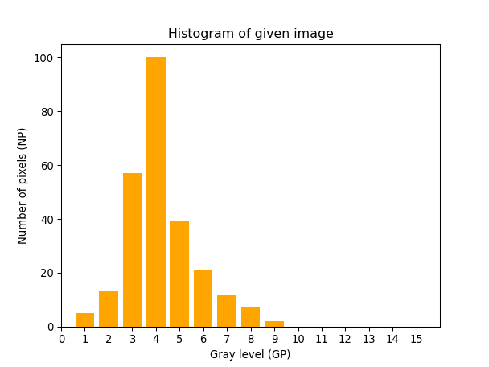
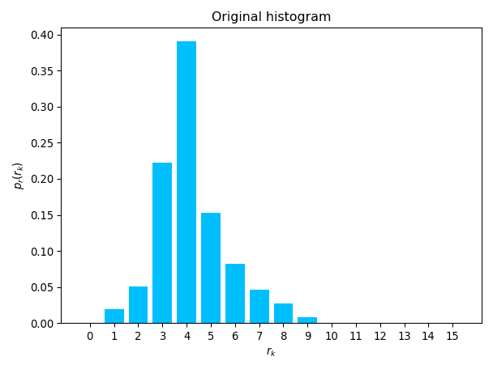
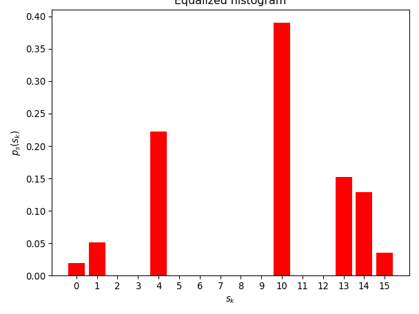
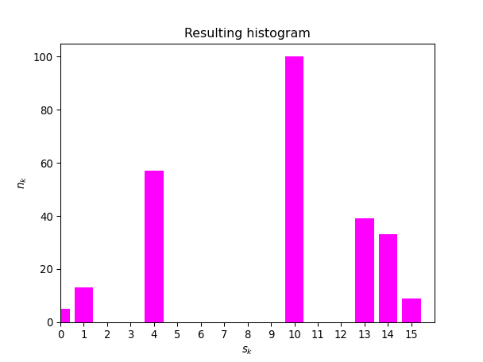
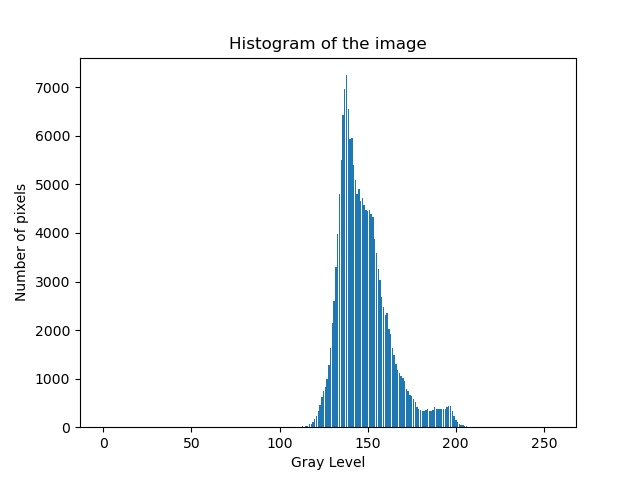

# COMP 478 - Image Processing

## Assignment 01

| Name                  | ID       |
| :-------------------- | :------- |
| Vaansh Vikas Lakhwara | 40114764 |

### Part I: Theoretical questions

**1. a)** In order to get a flat histogram, you would need an image with _L_ groups of _L_ pixels having the same intensity, which is usually not the case with an input image which is why usually no new intensity levels are created since the input (r<sub>n</sub>) and output (L-1 \* p(s<sub>n</sub>)) intensities are going to be similar. The technique does flatten them a little, resulting in image with an enhanced contrast, but not completely for the aforementioned reasons.

**b)** The discrete histogram equalization technique produces a _uniformly distributed_ image. Therefore, re-running this technique does not yield a flat histogram – the resulting image would be relatively unchanged.

---

**2.** No. H [af(x, y) + bg(x, y)] != aH [f(x, y)] + bH [g(x, y)] for an operator that computes the median of a set of pixels of a sub-image area.

Consider an example where:

1. a = b = 1
2. f(x, y) = {1, 2, 3} => aH [f(x, y)] = median of {1, 2, 3} = 2
3. g(x, y) = {1, -2, 3} => bH [g(x, y)] = median of {1, -2, 3} = 1

Therefore,
LHS = H [af(x, y) + bg(x, y)] = H [{1, 2, 3} + {1, -2, 3}] = median of {2, 0, 6} = 2
RHS = aH [f(x, y)] + bH [g(x, y)] = 2 + 1 = 3

LHS != RHS => QED

---

**3. a)**


**Code used to generate histogram:**

```python
def theory_function_3a():
    x = np.arange(16)
    y = np.array([0, 5, 13, 57, 100, 39, 21, 12, 7, 2, 0, 0, 0, 0, 0, 0])

    plt.bar(x, y, color="orange")

    plt.xlabel("Gray level (GP)")
    plt.ylabel("Number of pixels (NP)")

    plt.gca().set_xlim([0, 16])

    plt.title("Histogram of given image")
    plt.xticks(np.arange(0, 16, 1.0))

    plt.savefig("img/theory/Figure_3a.png", dpi=95)
    plt.show()
```

**b) i)** _n_ = 256 since that is the sum of all _n<sub>k</sub>_ (image size)
_L_ = 16 since it is a 4 bit image (intensity)

| _r<sub>k</sub>_ | _n<sub>k</sub>_ | _p<sub>r</sub>(r<sub>k</sub>)_ | _s<sub>k</sub>_ |
| --------------- | --------------- | ------------------------------ | --------------- |
| 0               | 0               | 0/256 = 0                      | 0               |
| 1               | 5               | 5/256 = 0.01953125             | 0               |
| 2               | 13              | 13/256 = 0.05078125            | 1               |
| 3               | 57              | 57/256 = 0.22265625            | 4               |
| 4               | 100             | 100/256 = 0.390625             | 10              |
| 5               | 39              | 39/256 = 0.15234375            | 13              |
| 6               | 21              | 21/256 = 0.08203125            | 14              |
| 7               | 12              | 12/256 = 0.046875              | 14              |
| 8               | 7               | 7/256 = 0.02734375             | 15              |
| 9               | 2               | 2/256 = 0.0078125              | 15              |
| 10              | 0               | 0/256 = 0                      | 15              |
| 11              | 0               | 0/256 = 0                      | 15              |
| 12              | 0               | 0/256 = 0                      | 15              |
| 13              | 0               | 0/256 = 0                      | 15              |
| 14              | 0               | 0/256 = 0                      | 15              |
| 15              | 0               | 0/256 = 0                      | 15              |

**ii)**

| _s<sub>k</sub>_ | _n<sub>k</sub>_ | _p<sub>s</sub>(s<sub>k</sub>)_ |
| --------------- | --------------- | ------------------------------ |
| 0               | 5               | 5/256 = 0.01953125             |
| 1               | 13              | 13/256 = 0.05078125            |
| 4               | 57              | 57/256 = 0.22265625            |
| 10              | 100             | 100/256 = 0.390625             |
| 13              | 39              | 39/256 = 0.15234375            |
| 14              | 33              | 33/256 = 0.12890625            |
| 15              | 9               | 9/256 = 0.03515625             |




**Code used to generate histograms:**

```python
def theory_function_3bii():
    p_rk_x = np.arange(16)
    p_rk_y = np.array([
        0, 0.01953125, 0.05078125, 0.22265625, 0.390625, 0.15234375,
        0.08203125, 0.046875, 0.02734375, 0.0078125, 0, 0, 0, 0, 0, 0
    ])

    p_sk_x = np.array([0, 1, 4, 10, 13, 14, 15])
    p_sk_y = np.array([
        0.01953125, 0.05078125, 0.22265625, 0.390625, 0.15234375, 0.12890625,
        0.03515625
    ])

    plt.bar(p_rk_x, p_rk_y, color="deepskyblue")
    plt.xlabel("$r_k$")
    plt.ylabel("$p_r(r_k)$")
    plt.title("Original histogram")
    plt.xticks(np.arange(0, 16, 1.0))
    plt.tight_layout()
    plt.savefig("img/theory/Figure_3bii1.png", dpi=95)
    plt.show()

    plt.bar(p_sk_x, p_sk_y, color="red")
    plt.xlabel("$s_k$")
    plt.ylabel("$p_s(s_k)$")
    plt.xticks(np.arange(0, 16, 1.0))
    plt.tight_layout()
    plt.title("Equalized histogram")
    plt.savefig("img/theory/Figure_3bii2.png", dpi=95)
    plt.show()
```

**c)**


**Code used to generate histogram:**

```python
def theory_function_3c():
    s_k_x = np.array([0, 1, 4, 10, 13, 14, 15])
    n_k_y = np.array([5, 13, 57, 100, 39, 33, 9])

    plt.bar(s_k_x, n_k_y, color="magenta")

    plt.xlabel("$s_k$")
    plt.ylabel("$n_k$")

    plt.gca().set_xlim([0, 16])

    plt.title("Resulting histogram")
    plt.xticks(np.arange(0, 16, 1.0))

    plt.savefig("img/theory/Figure_3c.png", dpi=95)
    plt.show()
```

---

**4.**
Let
&emsp;_f(x, y)_ = _r<sub>k</sub>_
Given that
&emsp;_g(x, y)_ = _c_

Since the gray levels of the pixels of both images have positive values

1. For _f(x, y) + g(x, y)_, resulting image will:
   - have output intensity _r<sub>k</sub>_ + _c_ for each (_x_, _y_)
   - remain evenly spaced
2. For _f(x, y) \* g(x, y)_, resulting image will:
   - have output intensity _r<sub>k</sub>_ \* _c_ for each (_x_, _y_)
   - remain evenly spaced

---

### Part II: Programming questions

**1. 1)**

```python
from PIL import Image


def programming_function_1(
    path="img/HawkesBay.jpeg", save_dir="img/programming", fmt="JPEG"
):
    image = Image.open(path).convert("L")
    image.show()
    image.save(save_dir + "/Figure_1.jpeg", fmt)

```

**Output:**


**2)**

```python
import cv2
import matplotlib.pyplot as plt


def programming_function_2(path="img/HawkesBay.jpeg", save_dir="img/programming"):
    image = cv2.imread(path, 0)
    hist = cv2.calcHist([image], [0], None, [256], [0, 256])
    plt.plot(hist)
    plt.title("Histogram of the image")
    plt.savefig(save_dir + "/Figure_2.jpeg")
    plt.show()

```

**Output:**

