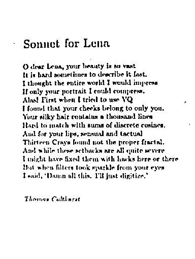
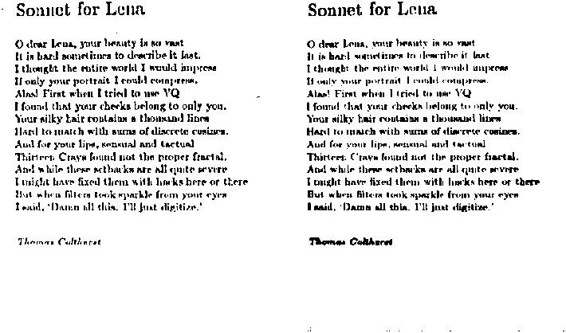

# COMP 478 - Image Processing

## Assignment 02

| Name                  | ID       |
| :-------------------- | :------- |
| Vaansh Vikas Lakhwara | 40114764 |

### Part I: Theoretical questions

**1.** It is given that the thinning processes could result in broken strings of 1s with gaps ranging from 1 to 5 pixels, which means the longest possible gap is 5.

We need to choose a filter with dims. $3$x$3$, $5$x$5$, $7$x$7$, ...

The maximum size of the gap is 5, so the next largest odd numbered filter size is chosen, i.e, 7.

$\therefore$ the minimum size of the blurring mask to accomplish the task is $7$.

The value of the threshold can be calculated for a weighted filter where only two pixels are considered. So, the minimum threshold value would be 1/7 x 1/7.

$\therefore$ the minimum value of the threshold to accomplish the task is $1/49$.

**2.**
We know that a Laplacian filter represents:

$$
\begin{aligned}
    \nabla^2 f &=\frac{\partial^2 f}{\partial^2 x}+\frac{\partial^2 f}{\partial^2 y} \\
\end{aligned}
$$

and that

$$
\begin{aligned}
    s &=\sum_{i=1}^m \sum_{j=1}^m w_{i j} = 0\\
\end{aligned}
$$

where s = sum of all elements in matrix and m = matrix size

It is given that:

$$
\begin{aligned}
    w_{2 2} = -16
\end{aligned}
$$

Rules that you should follow to build such a filter:

- extreme intensity changes are noted in the result
- generally sum(all elements) - sum(center) = 0

Therefore,

$$
\begin{aligned}
    s &=\sum_{i=1}^m \sum_{j=1}^m w_{i j : i !=j} = -16\\
\end{aligned}
$$

| Example of 3x3 filter                                                                                                                                                                                                                     | Example of 5x5 filter                                                                                                                                                                                                                                                                                                                                                                                                                                                                 |
| ----------------------------------------------------------------------------------------------------------------------------------------------------------------------------------------------------------------------------------------- | ------------------------------------------------------------------------------------------------------------------------------------------------------------------------------------------------------------------------------------------------------------------------------------------------------------------------------------------------------------------------------------------------------------------------------------------------------------------------------------- |
| <table> <tr> <td></td> <td></td> <td></td> </tr> <tr> <td>0</td> <td>-1</td> <td>0</td> </tr> <tr> <td>-1</td> <td>4</td> <td>-1</td> </tr> <tr> <td>0</td> <td>-1</td> <td>0</td> </tr> <tr> <td></td> <td></td> <td></td> </tr></table> | <table> <tr> <td></td> <td></td> <td></td> <td></td> <td></td> </tr> <tr> <td>1</td> <td>1</td> <td>1</td> <td>1</td> <td>1</td> </tr> <tr> <td>1</td> <td>1</td> <td>1</td> <td>1</td> <td>1</td> </tr> <tr> <td>1</td> <td>1</td> <td>-24</td> <td>1</td> <td>1</td> </tr> <tr> <td>1</td> <td>1</td> <td>1</td> <td>1</td> <td>1</td> </tr> <tr> <td>1</td> <td>1</td> <td>1</td> <td>1</td> <td>1</td> </tr> <tr> <td></td> <td></td> <td></td> <td></td> <td></td> </tr></table> |

$\therefore$ 5-by-5 Laplacian-like filter with the center element equal to -16:

|     |     |     |     |     |
| --- | --- | --- | --- | --- |
| 0   | 0   | 1   | 0   | 0   |
| 0   | 1   | 2   | 1   | 0   |
| 1   | 2   | -16 | 2   | 1   |
| 0   | 1   | 2   | 1   | 0   |
| 0   | 0   | 1   | 0   | 0   |
|     |     |     |     |     |

**3. a)**

The difference is that my result contains the term e<sup>$-j \pi \mu W$</sup>, whereas it is not in `Example 4.1`.

By Euler's Equation:
$$e^{ix} = cos(x)+isin(x)$$

$$
\begin{aligned}
F(\mu) &=\int_{-\infty}^{\infty} f(t) e^{-j 2 \pi \mu t} d t=\int_{0}^{W} A e^{-j 2 \pi \mu t} d t \\
&=\frac{-A}{j 2 \pi \mu}\left[e^{-j 2 \pi \mu t}\right]_{0}^{W}=\frac{-A}{j 2 \pi \mu}\left[e^{-j 2 \pi \mu W}-e^{0}\right] \\
&=\frac{A}{j 2 \pi \mu}e^{-j \pi \mu W}\left[e^{j \pi \mu W}-e^{-j \pi \mu W}\right] \\
&=A W \frac{\sin (\pi \mu W)}{(\pi \mu W)} e^{-j \pi \mu W}\
\end{aligned}
$$

When A = W = 1:

$$
\begin{aligned}
F(\mu) &=A W \frac{\sin (\pi \mu W)}{(\pi \mu W)} e^{-j \pi \mu W} =\frac{\sin (\pi \mu)}{(\pi \mu)} e^{-j \pi \mu}\
\end{aligned}
$$

**b)** Let box function be denoted by $b(x)$ and define it as follows:

$$
\begin{aligned}
b(x) =
    \begin{cases}
       \text{A,} &\quad if -W/2\le\text{x}\le{W/2}\\
       \text{0,} &\quad\text{otherwise} \\
    \end{cases}
\end{aligned}
$$

Finding the fourier transform for the box function:

$$
\begin{aligned}
F(b(x)) &=\int_{-\infty}^{\infty} b(x) e^{-j 2 \pi \mu t} d t=\int_{-1/2}^{1/2} e^{-j 2 \pi \mu t} d t \\
&=\frac{-1}{j 2 \pi \mu}\left[e^{-j 2 \pi \mu t}\right]_{-1/2}^{1/2}=\frac{-1}{j 2 \pi \mu}\left[e^{-j \pi \mu}-e^{j \pi \mu}\right] \\
&=\frac{\sin (\pi \mu)}{(\pi \mu)}=sinc(\mu)\
\end{aligned}
$$

Let tent function be denoted by $t(x)$. It is a convolution of $b(x)$.
$\therefore F(t(x)) = F(b(x) * b(x)) = F(b(x)) * F(b(x)) = sinc^{2}(\mu)$

---

### Part II: Programming questions

**1. Code:**

```matlab
function q1()
    % read
    I = imread("img/Doc.tiff");

    % initialize parameters and
    % call custom function
    [m, c] = deal(9, 5.5);
    O = adaptive_thresholding(I, m, c);

    % initialize parameters and
    % call built-in function
    s = 0.7;
    T = adaptthresh(I, s);
    M = imbinarize(I, T);

    % compare and save
    imshowpair(O, M, "montage")
    imwrite(O, "img/prog/output.tiff");
end

function [O] = adaptive_thresholding(I, m, c)
    % get size
    [row, col, x] = size(I);

    % initialize empty output
    O = zeros(row, col);

    % create a new image with padded boundary
    boundary_len = floor(m / 2);
    K = padarray(I, [boundary_len, boundary_len]);

    % loop through every pixel
    for i= 1 : row
        for j = 1 : col
            % get average of local window
            win = K(i : i + m - 1, j : j + m - 1);
            avg = mean(win(:));

```

```matlab
            % compute threshold
            thr = avg - c;

            % set output pixel accordingly
            if (I(i, j) >= thr)
                O(i, j) = 1;
            end
        end
    end
end
```

**Output:**

Window size (m) = 9 x 9
Constant (c) = 5.5

<div style="width:800px; margin:0 auto; page-break-after: always;">
    
</div>

**Discussion:**

- `parameter(s)`: The input arguments for the method are image`I`, window size`m`, and constant`c`as that is all that is required to calculate the threshold transfer function value.
- `filter`: Averaging filter used locally was a simple mean based filter.
- `built-in`: Parameters were tweaked as both functions require different types of arguments. Overall, the results are similar but the text appears darker in the built-in method. This could be due to the set sensitivity level in the built-in`addaptivethresh` function call. Below are the results in tabular form.

<br><br>

<table>
  <thead>
    <tr>
      <th>My Result</th>
      <th>Built-in Matlab</th>
    </tr>
  </thead>
  <tbody>
    <tr>
      <td>Window size (m) = 9 x 9<br />Constant (c) = 5.5</td>
      <td>sensitivity (s) = 0.7</td>
    </tr>
    <tr>
      <td colspan="2">
        
      </td>
    </tr>
  </tbody>
</table>
