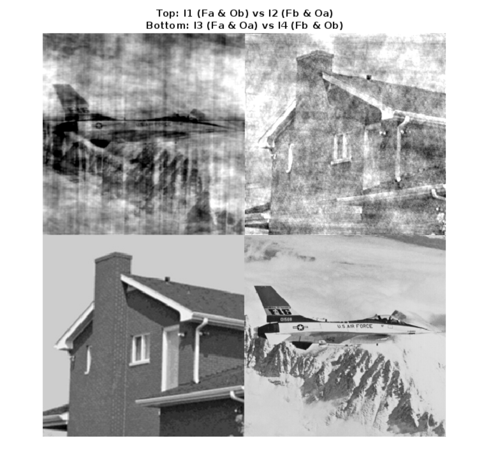
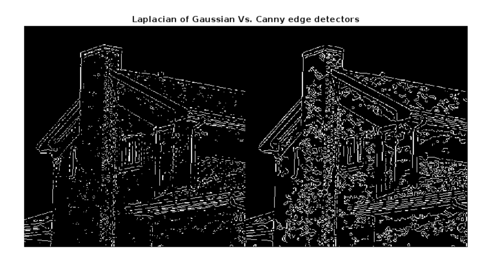

# COMP 478 - Image Processing

## Assignment 03

| Name                  | ID       |
| :-------------------- | :------- |
| Vaansh Vikas Lakhwara | 40114764 |

### Part I: Theoretical questions

**1.** Let center of the resulting $3×3$ image in the spatial domain be represented by $f(x, y)$.

$\therefore$ The four closest neighbours are $f(x + 1, y)$, $f(x - 1, y)$, $f(x, y + 1)$ & $f(x, y - 1)$.

Filter in spatial domain:

$$
h(x, y) = \frac{1}{4}\begin{bmatrix}
    0 & 1 & 0 \\
    1 & 0 & 1 \\
    0 & 1 & 0
\end{bmatrix}
$$

The resulting image in the spatial domain:

$$
\begin{align*}
  g(x, y) &= f(x, y) * h(x, y) \\
  &= \frac{1}{4}(f(x + 1, y) + f(x - 1, y) + f(x, y + 1) + f(x, y - 1)) \\
\end{align*}
$$

Using the translation property:

$$
f\left(x-x_0, y-y_0\right) \Leftrightarrow F(u, v) e^{-j 2 \pi\left(u x_0 / M+v y_0 / N\right)}
$$

and by Euler's Equation:

$$
e^{ix} = cos(x)+i \cdot sin(x)
$$

The resulting image in the frequency domain:

$$
\begin{align*}
  G(u, v) &= F(u, v) \cdot \frac{1}{4}(e^{\frac{j 2 \pi u}{M}} + e^{\frac{-j 2 \pi u}{M}} + e^{\frac{-j 2 \pi v}{N}} + e^{\frac{j 2 \pi v}{N}}) \\
    &= F(u, v) \cdot \frac{1}{4}(
    2 \cdot cos(\frac{2 \pi u}{M}) + \cancel{j \cdot sin(\frac{2 \pi u}{M})} - \cancel{j \cdot sin(\frac{2 \pi u}{M})} + 2 \cdot cos(\frac{2 \pi v}{N}) + \cancel{j \cdot sin(\frac{2 \pi v}{N})} - \cancel{j \cdot sin(\frac{2 \pi v}{N})}) \\
    &= F(u, v) \cdot \frac{1}{2}(
    cos(\frac{2 \pi u}{M}) + cos(\frac{2 \pi v}{N})) \\
    &= F(u, v) \cdot H(u, v) \\
\end{align*}
$$

Which means our filter in frequency domain is given by:

$$
\begin{align*}
  H(u, v) &= \frac{1}{2}(
    cos(\frac{2 \pi u}{M}) + cos(\frac{2 \pi v}{N})) \\
\end{align*}
$$

**2.** Radon transformation:

$$
\begin{align}
    \mathcal{R} f \equiv g(\rho, \theta) = \int_{-\infty}^{\infty} \int_{-\infty}^{\infty} f(x, y) \delta(x \cos \theta+y \sin \theta-\rho) d x d y \\
\end{align}
$$

**a)** To prove its linearity it is sufficient to prove that

$$
\begin{align*}
    \mathcal{R} (af_{1} + bf_{2}) = a\mathcal{R} f_{1} + b\mathcal{R} f_{2}
\end{align*}
$$

Plugging into Equation $(1)$

$$
\begin{align*}
    \mathcal{R} (af_{1} + bf_{2})
    &= \int_{-\infty}^{\infty} \int_{-\infty}^{\infty} (af_{1}(x, y) + bf_{2}(x, y))\delta(x \cos \theta+y \sin \theta-\rho) d x d y \\
    &= \int_{-\infty}^{\infty} \int_{-\infty}^{\infty} af_1(x, y) \delta(x \cos \theta+y \sin \theta-\rho) d x d y + \int_{-\infty}^{\infty} \int_{-\infty}^{\infty} bf_2(x, y) \delta(x \cos \theta+y \sin \theta-\rho) d x d y\\
    &= ag_{1}(\rho, \theta) + bg_{2}(\rho, \theta) \equiv a\mathcal{R} f_{1} + b\mathcal{R} f_{2}
\end{align*}
$$

$\square$

**b)** To prove its translation property it is sufficient to prove that

$$
\begin{align*}
    \mathcal{R} f(x-x_0, y-y_0) \equiv g(\rho - x_0\cos\theta- y_0\sin\theta,\theta)
\end{align*}
$$

Plugging into Equation $(1)$

$$
\begin{align*}
    \mathcal{R} f(x-x_0, y-y_0)
    &= \int_{-\infty}^{\infty} \int_{-\infty}^{\infty} f(x, y) \delta((x-x_0) \cdot \cos \theta+ (y-y_0) \cdot \sin \theta-\rho) d x d y \\
    &= \int_{-\infty}^{\infty} \int_{-\infty}^{\infty} f(x, y) \delta(x \cos \theta+y \sin \theta-\rho - x_0\cos\theta- y_0\sin\theta) d x d y \\
    &\equiv g(\rho - x_0\cos\theta- y_0\sin\theta,\theta)
\end{align*}
$$

$\square$

### Part II: Programming questions

**1.** Consider $I_{3}$ and $I_{4}$ – reconstructed with the correct corresponding magnitude $|F|$ and phase angles $\Omega$.

Clearly $I_{2}$ is a better reconstruction of $I_{3}$ than $I_{1}$. This is because $I_{2}$ and $I_{3}$ have the same phase angle $\Omega_{A}$ which signifies the shape/structure/details of the image.



<div style="page-break-after: always;"></div>

**Code:**

```matlab
% Load and process images
H = imread("house.tif");
H = H(:, :, 1);
H = im2double(H);

J = imread("jet.tif");
J = J(:, :, 1);
J = im2double(J);

% Separate images into magnitude
% & phase angle using 2D fft
Hfft = fft2(H);
Fa = abs(Hfft);
Oa = angle(Hfft);

Jfft = fft2(J);
Fb = abs(Jfft);
Ob = angle(Jfft);

% Construct images as required
Ifd1 = Fa .* exp(j * Ob);
I1 = ifft2(Ifd1);

Ifd2 = Fb .* exp(j * Oa);
I2 = ifft2(Ifd2);

Ifd3 = Fa .* exp(j * Oa);
I3 = ifft2(Ifd3);

Ifd4 = Fb .* exp(j * Ob);
I4 = ifft2(Ifd4);

% Output images
montage({I1, I2, I3, I4});
title({"Top: I1 (Fa & Ob) vs I2 (Fb & Oa)",
    "Bottom: I3 (Fa & Oa) vs I4 (Fb & Ob)"})

```

**2.**

**(1)** Steps involed:

<ol type="a">
  <li>
    <b>Laplacian of Gaussian (Marr-Hildreth) edge detector</b>
  </li>
  <ol>
    <li>Smoothing the image with a Gaussian lowpass filter.</li>
    <li>Find Laplacian of the resulting image with a Laplacian mask.</li>
    <li>Finding zero crossings of the image.</li>
  </ol>
  <li>
    <b>Canny edge detector</b>
  </li>
  <ol>
    <li>Smoothing the image with a Gaussian lowpass filter.</li>
    <li>Using Sobel operator to determine the edge magnitude.</li>
    <li>Using Sobel operator to determine the edge direction.</li>
    <li>Relate edge directions by grouping them into discrete bins.</li>
    <li>Suppress non-edge pixels i.e, non-maximum suppression.</li>
    <li>Link the edges together.</li>
  </ol>
</ol>

**(2)** Final step of edge linking results in an image with strong edges and the connected weak edges. Implementation in Canny algorithm:

1. Define high ($T_1$) and low ($T_2$) thresholds.
2. If the value is greater than the high threshold or it is between the low and high thresholds ($T_1 \leq$ value i.e, start of an edge or $T_2 \leq$ value $\lt T_1$ i.e, continuation of the edge) it is an edge point, otherwise it is not an edge point. Use this to eventually connect the weak and strong edges.

No, the first method does not need this step as we do not find the direction of edges since a Laplacian filter is used.

**(3)** Parameters:

1. The Gaussian kernel spread/size represented by $\sigma$. For both LoG and Canny detectors I used the default `edge` method values for $\sigma$ i.e, $2$ for the standard deviation of the Laplacian of Gaussian filter and $\sqrt{2}$ for the standard deviation of the Gaussian filter respectively since the results below were satisfactory with these values. A small value detects the finer features whereas a large value detects larger scale edges.
2. The low and high threshold for the Canny. This determines the final step of edge linking as described in the answer to sub-question (2). I again went with the default `edge` method values for the threshold (representing the `[low, high]` thresholds that is $[0, 1]$ calling the `approxcanny` method) in Matlab since the results were satisfactory.

**(4)**



**Note:** `lhs` represents LoG edge detector/result and `rhs` represents Canny edge detector/result below.

Comments:

1. Overall rhs does a better job than lhs at detecting edges.
2. rhs detects the weak edges that are connected to the strong edges whereas lhs does not.
3. lhs is noise-sensitive while rhs is less affected by noise which can be attributed to point number 2.

**Code:**

```matlab
I = imread("img/house.tif");
I = I(:, :, 1);

L = edge(I, "LoG");
C = edge(I, "Canny");

montage({L, C})
title("Laplacian of Gaussian Vs. Canny edge detectors")

```
