# COMP 478 - Image Processing

## Assignment 04

| Name                  | ID       |
| :-------------------- | :------- |
| Vaansh Vikas Lakhwara | 40114764 |

### Part I: Theoretical questions

**1.**

**Given:**

$$
\begin{align}
  & P_1 m_1+P_2 m_2=m_G \\
  & P_1+P_2=1 \\
  & \sigma_B^2=P_1\left(m_1-m_G\right)^2+P_2\left(m_2-m_G\right)^2
\end{align}
$$

**To prove that:**
${\sigma_B}^2=P_1 P_2\left(m_1-m_2\right)^2$

Plug in Eq. (1) into Eq. (3) then use Eq. (2) to simplify to the result

$$
\begin{aligned}
  \sigma_B^2 &= P_1\left(m_1-(P_1 m_1+P_2 m_2)\right)^2+P_2\left(m_2-(P_1 m_1+P_2 m_2)\right)^2 \\
  &= P_1\left(m_1-((1-P_2) m_1+P_2 m_2)\right)^2+P_2\left(m_2-(P_1 m_1+(1-P_1) m_2)\right)^2 & \because (2)\\
  &= P_1\left(P_2(m_2-m_1)\right)^2+P_2\left(P_1(m_2-m_1)\right)^2\\
  &= P_1P_2\left(P_1+P_2 \right) (m_2-m_1)^2\\
  &= P_1P_2(m_2-m_1)^2 & \because (2)\\
  \square \\
\end{aligned}
$$

**2.** In the Cartesian plane (aka image space) it is represented by `y = ax + b` where `a` is the slope and `b` is the intercept. However as the line is closer to the vertical direction, the slope approaches infinity. Therefore, the normal representation (aka the parameter space) is preferred where the distance ($\rho$) of the normal from the origin and the angle ($\theta$) made by it is considered. The principle idea is that a point in the image space maps to a line in the parameter plane and vice versa.

For a given set of points, the parameter space is divided into bins. The number of sinusoids passing through each bin is then accumulated. Using this information, the threshold can be determined. This is the process of Hough transform for line searching on a set of `n` points.

**3.** I would approach this problem by first getting rid of the smaller dots and then counting all the leftover "larger" dots using a feature extraction technique (such as Hough's transform).

I decided to try this out with opencv in python.

**Initial Image**

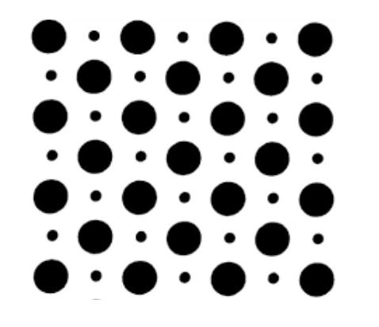

First I used erosion followed by a Gaussian blur – to completely get rid of the smaller dots.

_Note:_ In the eroded image the dot sizes are reduced but they can still be seen, so I used a Gaussian kernel to blur the image further and completely get rid of those smaller dots.

|        Eroded Image         | Eroded and Blurred Image (No small dots) |
| :-------------------------: | :--------------------------------------: |
| 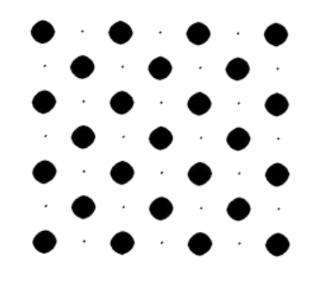 |       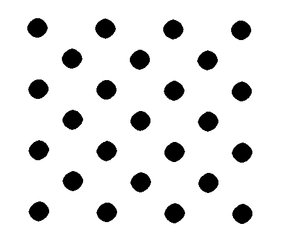        |

Then, I used Hough's transform to calculate the number of the leftover (i.e., only larger black) dots.

**Final Result**

 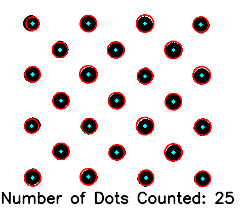

**Code used to develop images above:**

```python
import cv2
import numpy as np


def main():
    image = cv2.imread("img/q3.png")
    image = cv2.cvtColor(image, cv2.COLOR_BGR2GRAY)

    # invert, erode and invert back
    image = cv2.bitwise_not(image)
    eroded = cv2.erode(image, np.ones((9, 9), np.uint8), iterations=1)
    eroded = cv2.bitwise_not(eroded)
    cv2.imwrite("img/q3_output_1.png", eroded)

    # Gaussian blur to get rid of the small dots completely
    blurred = cv2.GaussianBlur(eroded, (5, 5), 0)
    blurred = cv2.threshold(blurred, 100, 255, cv2.THRESH_BINARY)[1]
    cv2.imwrite("img/q3_output_2.png", blurred)

    # use Hough transform to get the number of circles
    res = blurred
    circles = cv2.HoughCircles(
        res,
        cv2.HOUGH_GRADIENT,
        1,
        res.shape[0] / 64,
        param2=17,
        minRadius=1,
        maxRadius=100,
    )
    res = cv2.cvtColor(res, cv2.COLOR_GRAY2BGR)

    assert circles is not None
    circles = np.uint16(np.around(circles))

    # construct circles around the dots
    for (a, b, c) in circles[0, :]:
        cv2.circle(res, (a, b), c, (0, 0, 255), 2)
        cv2.circle(res, (a, b), 2, (255, 255, 0), 3)

    font = cv2.FONT_HERSHEY_SIMPLEX
    cv2.putText(
        res,
        "Number of Dots Counted: {}".format(circles.shape[1]),
        (1, 400),
        font,
        1,
        (0, 0, 0),
        2,
        cv2.LINE_AA,
    )

    cv2.imwrite("img/q3_output_3.png", res)


if __name__ == "__main__":
    main()

```

### Part II: Programming questions

**1.**

_Note:_ The code below has implementation for both (a) and (b)

**(a)**

|         Before Otsu         |        After Otsu         |
| :-------------------------: | :-----------------------: |
|  | 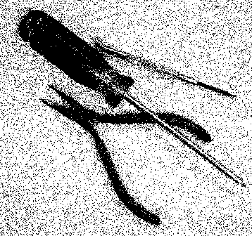 |

<div style="page-break-after: always;"></div>

**(b)**

| Before Otsu (with 5x5 averaging mask) | After Otsu (with 5x5 averaging mask) |
| :-----------------------------------: | :----------------------------------: |
|      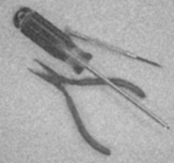      |     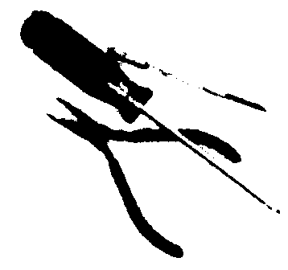      |

**Code:**

```python
import cv2
from PIL import Image
import numpy as np


def otsu(image, filename="q1_a"):
    (
        value,
        threshold,
        variance,
        max_variance,
        pixel_difference,
        sum_difference,
        cumulative_sum,
        cumulative_mean,
        global_intensity_mean,
    ) = (0, 0, 0, 0, 0, 0, 0, 0, 0)
```

<div style="page-break-after: always;"></div>

```python
    # 1. Compute the normalized histogram of the input image
    histogram, num_pixels = (
        np.histogram(
            [
                image.getpixel((width, height))
                for height in range(image.size[1])
                for width in range(image.size[0])
            ],
            range(257),
        ),
        image.size[0] * image.size[1],
    )

    # 2. Compute the cumulative sums
    total_sum = sum(i * histogram[0][i] for i in range(256))

    for i in range(256):
        value += histogram[0][i]
        if num_pixels <= value:
            break

        pixel_difference = num_pixels - value

        # 3. Compute the cumulative means
        cumulative_sum += i * histogram[0][i]
        sum_difference = total_sum - cumulative_sum

        # 4. Compute the global intensity mean
        global_intensity_mean, cumulative_mean = (
            cumulative_sum / value,
            sum_difference / pixel_difference,
        )

        # 5. Compute the between - class variance
        variance = (
            value * pixel_difference * (global_intensity_mean - cumulative_mean) ** 2
        )

        # 6. Obtain the Otsu's threshold
        if variance > max_variance:
            max_variance = variance
            threshold = i

    res = [
        0 if (image.getpixel((height, width)) <= threshold) else 255
        for width in range(0, image.size[1])
        for height in range(0, image.size[0])
    ]
    image.putdata(res)
    image.save("img/prog/{}.png".format(filename))

def q1_a():
    image = Image.open("img/tools_noisy.png")
    otsu(image.convert("L"))

def q1_b():
    # blur image first
    image = cv2.imread("img/tools_noisy.png")
    image = cv2.blur(image, (5, 5))
    image = Image.fromarray(image)
    image.save("img/prog/q1_b_1.png")
    otsu(image.convert("L"), filename="q1_b_2")

def main():
    q1_a()
    q1_b()

if __name__ == "__main__":
    main()

```

**2.**

_Note:_ The code below has implementation for both (a) and (b)

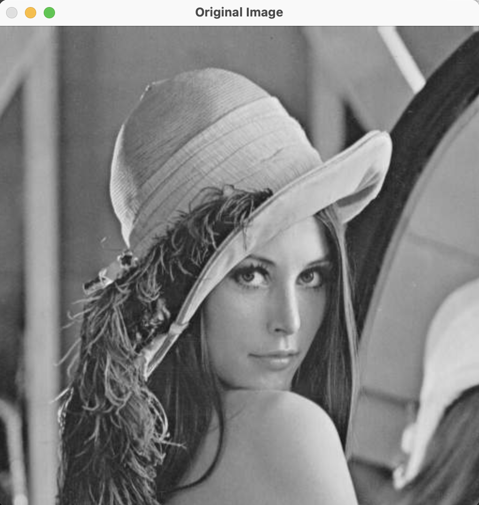

<div style="page-break-after: always;"></div>

**(a)**
**Haar Results**
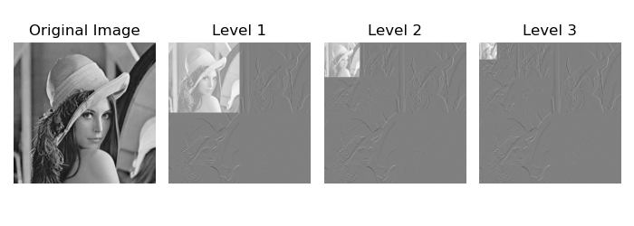
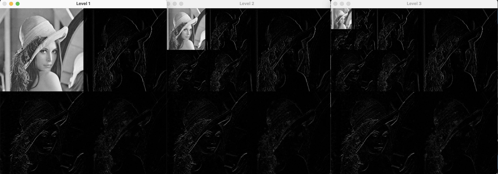

**(b)**
**Daubechies-4 Results**

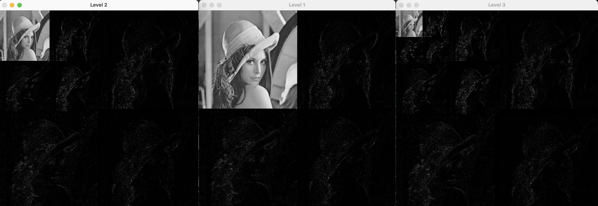

**(c)**

|    Haar approximation image    | Daubechies-4 approximation image |
| :----------------------------: | :------------------------------: |
| 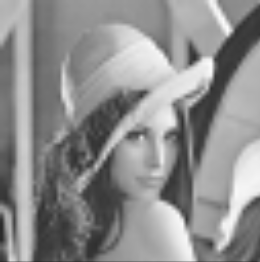 |  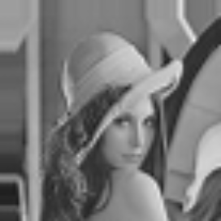   |

While both images are not very clear, it can be observed that the approximation image of the Daubechies-4 wavelet is slightly smoother than the approximation image of the Haar wavelet.

**Code:**

```python
import cv2
import pywt
import pywt.data

import numpy as np
import matplotlib.pyplot as plt


def wavelet(wavelet, levels=3):
    image = cv2.imread("img/lena.tif")
    image = cv2.cvtColor(image, cv2.COLOR_BGR2GRAY)
    image = np.float32(image)

    _, ax = plt.subplots(1, 4, figsize=[7, 2.5])
    for level in range(levels + 1):
        if level == 0:
            ax[0].set_axis_off()
            ax[0].imshow(image, cmap=plt.cm.gray)
            ax[0].set_title("Original Image")
            ax[0].set_axis_off()
            cv2.imshow("Original Image", cv2.imread("img/lena.tif"))
            continue

        coeff = pywt.wavedec2(image, wavelet="db4", level=level)
        coeff[0] /= np.abs(coeff[0]).max()

        for l in range(level):
            coeff[l + 1] = [d / np.abs(d).max() for d in coeff[l + 1]]

        res, _ = pywt.coeffs_to_array(coeff)
        cv2.imshow("Level {}".format(level), res)
        ax[level].imshow(res, cmap=plt.cm.gray)
        ax[level].set_title("Level {}".format(level))
        ax[level].set_axis_off()

    plt.tight_layout()
    plt.savefig("img/prog/q2_{}.png".format(wavelet))
    plt.show()

    cv2.waitKey(0)


def main():
    wavelet("haar")
    wavelet("db4")


if __name__ == "__main__":
    main()

```

<div style="page-break-after: always;"></div>
